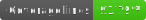

# reactotron-plugin-zustand

Plugin to monitor states from zustand.

   

## Install

```bash
npm i -D reactotron-plugin-zustand
```

## Setup

Go to file "Reactotron.config.ts" or your config reactotron from project, is similar to this file:

```ts
import reactotronZustand from 'reactotron-plugin-zustand';

Reactotron.configure({ name: 'Project name' })
  .use(
    //add this line 🙌
    reactotronZustand({
      stores: [{ name: 'auth', store: useAuth }],
      omitFunctionKeys: true
    })
  )
  .connect();
```

| Option             | Description                                                      | Default |
| ------------------ | ---------------------------------------------------------------- | ------- |
| `stores`           | List of stores to be monitored by the Reactotron Zustand plugin. |         |
| `stores[].name`    | Name of the store to be monitored.                               |         |
| `stores[].store`   | Reference to the store hook to be monitored.                     |         |
| `omitFunctionKeys` | Omit state functions (default is false).                         | false   |

## Usage

Install [Reactotron Client](https://github.com/infinitered/reactotron/tree/master) and add your store observer, using the example `"auth"` or all states using: `"*"`.


